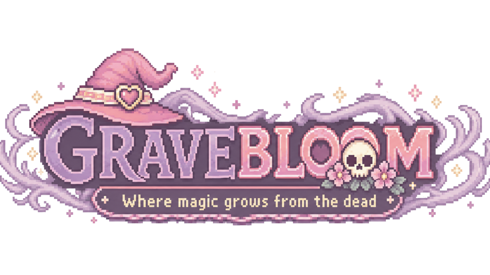
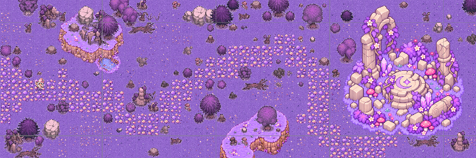
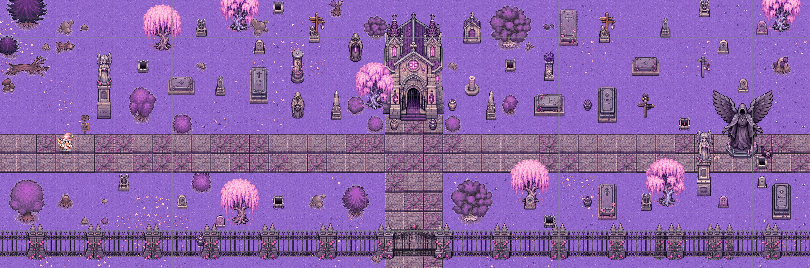
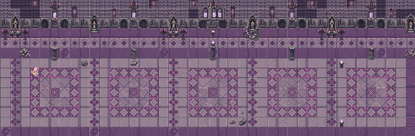
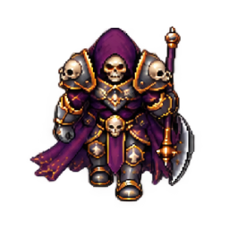

  

<h1 align="center">Gravebloom</h1>

  A cozy pixel-art top-down adventure where magic grows from the dead.

  Fight through haunted forests, master your spells, survive waves of skeletons
  and face the ruler of the graveyard.

---

## Gameplay Trailer

<h2 align="center">Gameplay Video</h2>

  <a href="https://youtu.be/9yLHHhzw6a0?si=UHfYN6QKZFetxQFk">
    ▶ Watch Gravebloom Gameplay on YouTube
  </a>

  <b>▶ Watch the gameplay video</b>

---

## About the Game

**Gravebloom** is a 2D top-down pixel-art action game where you play as a
witch fighting her way through increasingly corrupted forest environments.

Use magic attacks, shields and a powerful ultimate ability to survive enemy
waves, reach the next area and eventually confront the final boss.

The game combines a cozy pastel pixel-art style with darker graveyard and
gothic fantasy elements.

---

## Features

-  Play as a magical witch
-  Ranged basic magic attacks
-  Defensive shield ability
-  Powerful ultimate beam attack
-  Multiple skeleton enemy types
-  Final boss encounter
-  Health system and potion drops
-  Progressive enemy wave system
-  Three different levels
-  Continue from your last reached level
-  Original menu and gameplay audio
-  Player, enemy and UI sound effects
-  Master, Music and SFX volume settings
-  In-game pause menu

---

## Controls

| Action | Control |
|---|---|
| Move | `WASD` |
| Basic Attack | `Left Mouse Button` |
| Shield | `Right Mouse Button` |
| Ultimate | `Space` |
| Pause | `Esc` |

---

## Explore Gravebloom

### Level I — The Blooming Forest

A quiet magical forest where the corruption begins to spread.

  

### Level II — The Withered Woods

The deeper you travel, the more lifeless the world becomes.

  

### Level III — The Graveyard

Survive the final wave and face the creature waiting at the end.

  

---

## Enemies

### Skeleton Mage

A ranged enemy that follows the player and attacks with magical projectiles.

### Skeleton Warrior

A melee enemy that closes the distance and attacks at close range.

### The Skeleton King

The final enemy of Gravebloom.

Survive the last enemy wave to summon the boss and defeat him to complete
the game.

  

---

## Abilities

### Basic Magic

A fast ranged projectile used as the player's primary attack.

### Shield

Temporarily protects the player from incoming damage.

### Ultimate

A powerful magical beam capable of dealing significantly more damage than
the basic attack.

---

## Built With

- **Unity 6**
- **C#**
- **Universal Render Pipeline**
- **Unity Input System**
- **Unity 2D**
- **Audio Mixer**
- Custom pixel-art assets and animations

---

## Gravebloom

  <i>
    Magic grows where life ends.
  </i>

